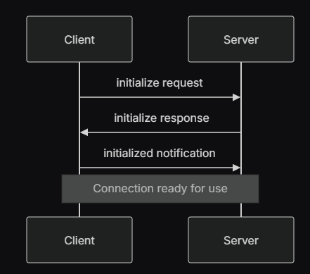

# What TH is MCP ?

MCP is fundamentally a specification based on a [typescript schema](https://github.com/modelcontextprotocol/modelcontextprotocol/blob/main/schema/2025-03-26/schema.ts#L37) that creates a standard protocol for connecting LLMs to external systems:
- Resources
- Tools
- Prompts 

MCP has concrete implementations in several languages including Python and Typescript SDKs.

## Open Question: Is `schema.ts` a complete implementation?

i.e. Does the typescript schema contain sufficient information to unambiguously define the protocol. Could I implement a new SDK with just the schema.ts file or do I need additional info? 

> 30 minutes: Let's read the docs

The answer is officially *kind of?* The schema.ts defines all of the nouns in the protocol but leaves ambiguity in terms of verbs and sequencing of events 

We have two independent *layers* which define how servers and clients interact:
1. Protocol Layer
2. Transport Layer

### Protocol Layer
Handles the 'what' of message passing. Defines message framing, request/response linking, and other high-level communication patterns.

```typescript
class Protocol<Request, Notification, Result> {
    // Handle incoming requests
    setRequestHandler<T>(schema: T, handler: (request: T, extra: RequestHandlerExtra) => Promise<Result>): void

    // Handle incoming notifications
    setNotificationHandler<T>(schema: T, handler: (notification: T) => Promise<void>): void

    // Send requests and await responses
    request<T>(request: Request, schema: T, options?: RequestOptions): Promise<T>

    // Send one-way notifications
    notification(notification: Notification): Promise<void>
}

// It's not clear if these are exclusive to server, client, or available for both. Somthing to research!
```

Notice the `Request`, `Notification`, and `Result` in the class type parameters. These are 3 of the 4 primary message types used by MCP. See the **Message Types** section below for full coverage.

### Transport Layer

Defines the 'how' of message passing. The transport layer handles the actual communication between clients and servers. MCP supports multiple transport mechanisms:

1. Stdio transport
    - Uses standard input/output for communication
    - Ideal for local processes
2. HTTP with SSE transport
    - Server -> Client messages: uses SSE
    - Client -> Server messages: uses HTTP POST

> All transports use JSON-RPC 2.0 to exchange messages. See the specification for detailed information about the Model Context Protocol message format.


### Message Types

1. **Request**: expects a response from the other side

    ```typescript
    interface Request {
        method: string;
        params?: { ... };
    }
    ```
2. **Result**: successful response to a request

    ```typescript
    interface Result {
        [key: string]: unknown;
    }
    ```
3. **Error**: indicates a request failed

    ```typescript
    interface Error {
        code: number;
        message: string;
        data?: unknown;
    }
    ```
4. **Notification**: one-way message that doesn't expect a response

    ```typescript
    interface Notification {
        method: string;
        params?: { ... };
    }
    ```

### Connection Life Cycle

You might call this the 'when' of MCP. 

#### 1. Initialization



This looks familiar. TCP anyone? 

1. Client sends **`initialize`** request with protocol version and capabilities
2. Server responds with its protocol version and capabilities
3. Client sends **`initialized`** notification as acknowledgment
4. Normal message exchange begins

#### **2. Message exchange**

After initialization, the following patterns are supported:

- **Request-Response**: Client or server sends requests, the other responds
- **Notifications**: Either party sends one-way messages

#### **3. Termination**

Either party can terminate the connection:

- Clean shutdown via **`close()`**
- Transport disconnection
- Error conditions

### Error Handling

MCP defines these standard error codes:

```typescript
enum ErrorCode {
  // Standard JSON-RPC error codes
  ParseError = -32700,
  InvalidRequest = -32600,
  MethodNotFound = -32601,
  InvalidParams = -32602,
  InternalError = -32603
}
```

SDKs and applications can define their own error codes above -32000.

Errors are propagated through:

- Error responses to requests
- Error events on transports
- Protocol-level error handlers

## Where are we at?

I understand MCP as the direct sum of the Protocol Layer, the Transport layer, and the Connection Lifecycle. 

I feel like we have the syntax but not the semantics. I've heard that MCP is about exposing tools, resources, prompts and that clients can do a kind of function calling on this. 

The question is whether these semantics are defined in the protocol or if they're more conventional. I think there is direct evidence of this in the schema.ts file. I probably just need to keep reading the docs.

---

> TODO Read the best practices section.

```text
Oh fuck yeah. Okay so the next few sections have these titles:

- Resources 
- Prompts
- Tools
- Sampling
- Roots
- Transports

This is just.. you know.. exactly what is needed.
```

